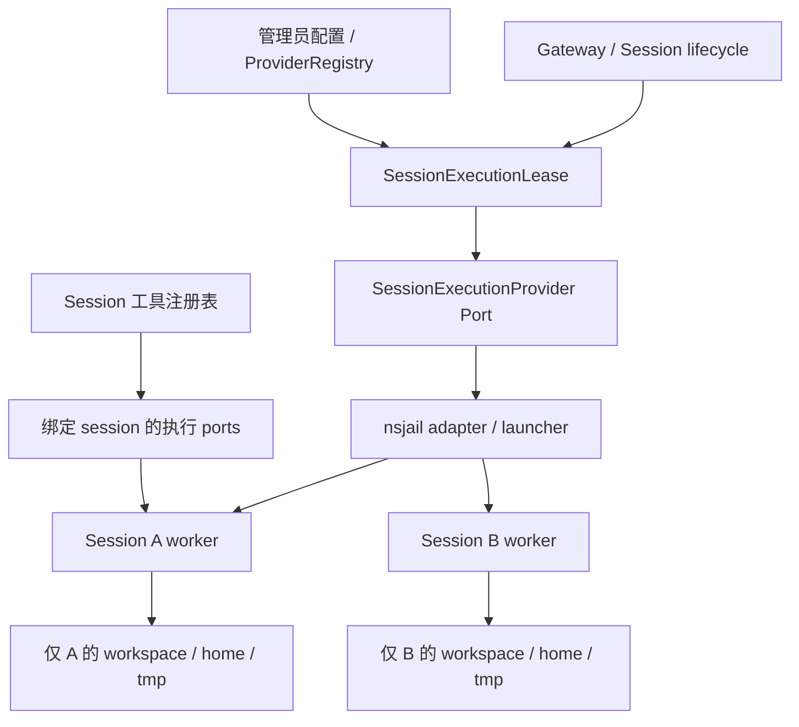

# PilotDeck 模块化 Session 沙箱开发文档

状态：第一版 provider 已实现；Gateway session 生命周期的完整接入仍在进行。日期：2026-10-06。

本文定义一个 PilotDeck 实例并发运行多个 session、每个 session 独立文件系统视图的开发方案。首个 provider 使用 Linux nsjail；核心依赖抽象执行接口，以便以后接入其他实现。当前分支已实现 provider、lease、session 文件边界、execution-world 注入和 Gateway session composition 接入；完整生命周期运维与扩展工具覆盖仍按验收文档推进。

配套文档：[验收规范](../testing/session-sandbox-acceptance.zh.md)。架构原则参考：[通用模块接入指南](../module-development-integration-guide.zh.md)、[模块通信 SOP](../pilotdeck-module-communication-sop.zh.md)。

## 1. 目标、边界与不变量

### 1.1 目标

- 一个 PilotDeck 服务负责 Gateway、AgentLoop、模型调用、会话持久化和调度；每个活跃 session 可以拥有独立工具 worker 子进程。
- 同一 project 下的 A、B session 可同时执行工具，各自只访问本 session 的可写文件。
- 即使 agent 知道其他 session 的宿主机绝对路径，也不能通过文件工具、任意 shell/Python、后台进程或工具回调读写它。
- 多种 provider 通过相同 Port 接入；provider 的实现和进程管理不得渗透到 AgentLoop。
- 插件不可用、能力不足或配置非法时阻止该隔离 session 启动，不降级到宿主执行。

### 1.2 可信边界

可信组件是 PilotDeck 主服务、管理员选择的 provider/launcher、基础 rootfs 和 Linux 内核。agent 生成的代码、工作区脚本、工具参数及其派生进程均不可信。nsjail 提供进程级隔离，不是虚拟机；本方案不承诺抵御内核漏洞或恶意宿主管理员。

共享基础运行库可以只读可见；“禁止读取其他 session 文件”包括对方 workspace、home、tmp、工具输出、会话历史和控制元数据，不是禁止读取所有公共运行库。

必须保持以下不变量：

1. 每个工具调用绑定宿主确认的 session capability，模型不能选择或覆盖 session 身份、宿主目录、挂载及 provider。
2. 任意 agent 可触达的本地文件或进程能力都通过当前 session 的执行环境；权限确认和 `bypassPermissions` 不能解除 OS 隔离。
3. 主服务和其他 session 的存储、控制接口、进程及 socket 不暴露给沙箱。
4. 不在共享对象上保存可变的 `currentSession`，不通过全局 `process.chdir()` 切换执行上下文。
5. 宿主拥有 session/turn/run/operation 最终状态；worker 只报告执行结果，不创建第二套会话状态。
6. 多个 session 不得绑定同一个可写目录或共享可写 inode；并发创建、恢复和回收必须维持该约束。

## 2. 当前代码与改造切入点

以下是当前工作区的静态阅读结论，不是运行验收结果。

| 当前模块 | 已有能力或限制 | 改造方向 |
| --- | --- | --- |
| [`ProjectExecutionWorldBundle`](../../src/cli/ProjectExecutionWorldBundle.ts) | 按 project 装配 execution world 和基础工具；有工厂注入点 | 保留项目级 provider 选择，新增 session execution lease |
| [`ExecutionWorldBundle`](../../src/tool/execution-world/ExecutionWorldBundle.ts) | 聚合 Fs、Shell、Subprocess、CodeRuntime、后台任务等 ports | 复用执行 ports；明确 session 生命周期和资源归属 |
| [`SandboxPort`](../../src/tool/execution-world/SandboxPort.ts) | 为单条命令准备包装，默认模式为 danger-full-access | 可作为进程包装细节；不能独自承担 session 隔离契约 |
| [`NodeSandboxPort`](../../src/tool/execution-world/NodeSandboxPort.ts) | 原生受限模式使用 macOS Seatbelt，其他平台不可用时拒绝 | 新增 nsjail provider，不在原生 adapter 内堆厂商分支 |
| [`SandboxedFsPort`](../../src/tool/execution-world/SandboxedFsPort.ts) | 读取透传，写入允许 workspace 及平台 tmp | 不能复用为 session 文件隔离保证；使用沙箱内文件 RPC |
| [`SessionToolCompositionBundle`](../../src/cli/SessionToolCompositionBundle.ts) | session 工具组合和可用性过滤 | 注入已绑定的执行 ports，按隔离能力限制扩展工具 |
| [`ProjectSessionRuntimeBundle`](../../src/cli/ProjectSessionRuntimeBundle.ts) | 使用项目执行资源及 session 工具装配 | 接入 lease 获取、释放、恢复以及后台任务事件 |
| [`ripgrep`](../../src/tool/builtin/filesystem/ripgrep.ts) | 通过 SubprocessPort 执行 rg，存在原生默认 provider | 隔离模式必须显式注入，rg 路径须为沙箱内路径 |
| [`execute_code`](../../src/tool/builtin/executeCode.ts) | 代码进程、临时空间和工具 RPC 可替换 | 进程和回调统一绑定原 session |
| [插件 manifest](../../src/extension/plugins/protocol/manifest.ts) | 有 MCP、hooks、skills 等声明 | 尚无本方案的 execution provider 声明，需新增注册契约 |
| [SDK sandbox 类型](../../packages/sdk/src/types.ts) | 已有 tool_policy 限制 | 与 OS 隔离分开建模，不改变旧字段的含义 |

不能只新增 `nsjail_bash` 工具，也不能只给共享项目工具注册表做浅复制：工具闭包若仍持有宿主 FsPort，就会绕过隔离。

## 3. 模块划分与所有权



| 模块 | 所有者与职责 | 不应承担 |
| --- | --- | --- |
| ProviderRegistry | 项目装配层；注册受信 provider、校验版本与能力 | 接受 agent 指定代码入口 |
| SessionExecutionLease | 核心 session 生命周期；身份、引用计数、generation、关闭门禁 | 生成 nsjail 命令行 |
| SessionExecutionProvider | 对外契约；创建 session 执行环境和返回能力 | 修改 transcript 或结束 turn |
| nsjail adapter / launcher | rootfs、namespace、挂载、进程/cgroup、资源限制 | 重新实现模型调用、权限审批 |
| worker 与 RPC adapter | 沙箱内文件与进程执行，协议映射、输出流和取消 | 提供任意宿主文件 RPC |
| ArtifactBridge | 可信导入导出，绑定 session，有限流与取消 | 将任意宿主绝对路径透传给模型 |
| SessionToolComposition | 为 session 构造工具实例、限制可用能力 | 静默选择原生 fallback |

建议新增位置：

```text
src/tool/execution-world/SessionExecutionProvider.ts
src/tool/execution-world/SessionExecutionProviderRegistry.ts
src/cli/SessionExecutionLeaseBundle.ts
src/extension/execution-providers/       # 受信插件注册与配置解析
packages/sandbox-nsjail/                 # 首个实现，最终包结构由构建方案确定
  src/provider.ts
  src/launcher.ts
  src/worker.ts
  src/rpc.ts
  src/policy.ts
```

这些是计划路径，目前不要求存在。进程内优先直接调用 Port；worker 因隔离需要跨进程。若复用 Module Protocol，必须显式注册 sandbox 契约和方法；不能假定已有 modules YAML 支持任意新插槽。

## 4. Provider 契约草案

下面是 TypeScript 设计草案，字段及公开导出需在实现阶段定稿。

```ts
interface SessionExecutionProvider {
  readonly id: string;
  readonly contractVersion: 1;
  probe(): Promise<ProviderReadiness>;
  createSession(binding: TrustedSessionBinding): Promise<SessionExecutionHandle>;
  dispose(): Promise<void>;
}

interface TrustedSessionBinding {
  readonly sessionKey: string;        // 核心提供的路由身份
  readonly sandboxKey: string;        // 核心分配的不可预测存储键
  readonly generation: number;        // 防止旧连接/结果污染恢复后的环境
  readonly storage: {
    workspace: string;               // 仅控制面使用的宿主路径
    home: string;
    temp: string;
  };
  readonly policy: SessionIsolationPolicy;
}

interface SessionExecutionHandle {
  readonly sandboxKey: string;
  readonly generation: number;
  readonly guestCwd: "/workspace";
  readonly capabilities: EnforcedSandboxCapabilities;
  readonly world: ExecutionWorldBundle; // 现有 ports 的 session 实例/适配器
  stop(reason: string): Promise<void>;  // 停止接单并回收进程，保留文件
  dispose(): Promise<void>;            // 幂等释放句柄；不得隐式删除 workspace
}
```

`ProviderReadiness` 应区分 supported、ready 和 failure reason；probe 不得仅检查 nsjail 二进制是否存在，必须执行最小受限进程探测。`SessionIsolationPolicy` 至少包括网络策略、资源限额、只读基础镜像和隔离要求。`EnforcedSandboxCapabilities` 报告实际落实的文件隔离、进程隔离、网络策略、资源限制及可用工具能力；缺少必需能力时创建失败。

运行请求使用已绑定的 handle，包含 request/operation 身份、deadline、取消信号以及沙箱内路径。wire 中的 session 字段仅供比对，不能覆盖连接绑定。调用任意注册工具的通用 RPC 不应直接暴露给 worker；允许的回调必须经该 session 的工具注册表和权限策略。

建议稳定错误类别：`sandbox_unavailable`、`sandbox_policy_unsupported`、`sandbox_path_denied`、`sandbox_resource_exhausted`、`sandbox_session_closed`、`sandbox_worker_lost`、`sandbox_generation_mismatch`。实际映射需保留原有工具错误和宿主 operation 语义；不能用 transport 错误覆盖已经确定的业务结果。

## 5. 文件系统、进程及通信设计

### 5.1 目录和路径空间

```text
宿主：/var/lib/pilotdeck/
  control/                         # 数据库、会话历史、provider 配置
  sessions/<sandboxKey>/
    workspace/
    home/
    tmp/

沙箱：/
  workspace/                       # 当前 session workspace，读写
  home/agent/                      # 当前 session home，读写且跨 resume 保留
  tmp/                             # 当前 session 私有持久目录
  usr/ lib/ ...                    # 最小运行 rootfs，只读
  proc/                            # 当前 PID namespace 的 proc
```

禁止挂载宿主 `/`、sessions 父目录、控制目录、宿主 `/tmp`、Docker socket 或共享可写缓存。不要把宿主动态 root 只读挂进沙箱，因为只读仍允许读取其他 session 文件。

模型可见 cwd 为 `/workspace`，系统提示、工具返回路径和 LSP URI 使用 guest 路径。宿主 projectRoot 用于配置与控制面身份，不能无区别替换为 guest cwd。给 worker 注入的 rg/Python/Node 路径也必须在 rootfs 中存在。

项目初始化采用独立复制或独立 CoW 快照，不使用可写硬链接。Git worktree 的共享 `.git`/对象库不能直接引出其他 workspace；首版推荐独立仓库副本。插件、依赖及缓存只读共享时必须只包含公共内容；安装、构建缓存使用 session 私有可写目录。当前 nsjail provider 将 session `home` 和 `tmp` 作为可写 bind mount，`HOME`、`TMPDIR`、`PYTHONUSERBASE` 和 `PIP_CACHE_DIR` 指向 guest 私有路径，因此用户配置、`pip --user` 包和缓存不会进入其他 session；shell 的 `export` 状态保存到该 session 的 `home/.pilotdeck/environment.sh`，resume 后重新加载。

### 5.2 nsjail 启动策略

- 每个活跃 session 启动一个常驻 worker；shell、Python、rg 等为其沙箱内子进程。
- 使用 mount、PID、IPC、UTS 和按策略配置的 network/user namespace；建立独立根文件系统，限制 capabilities，启用 no_new_privs，禁止沙箱进程重新挂载或进入宿主 namespace。
- 按部署环境确定 UID/GID 映射与 cgroup delegation。所需能力不满足时报 readiness 错误，不通过增加整个主服务权限来静默绕过。
- `/proc` 对应沙箱 PID namespace；不挂宿主 proc/sys，不允许访问宿主进程 root、fd 或 memory。
- 清理继承环境和 FD；只传入必要配置及专用通信端点。工作负载不得继承主服务管理凭据。
- cgroup 管理 session 的 CPU、内存和进程数；磁盘容量另用配额、限定容量卷或 tmpfs 控制，不能声称 cgroup 自动限制 workspace 磁盘。
- 使用经验证的 seccomp 策略限制不需要的系统调用；不得仅靠路径字符串检查宣称 OS 隔离。

最终 nsjail 配置应由固定模板与校验后的结构化参数生成，作为受信部署配置管理；agent 不能追加任意 nsjail 参数或挂载。

### 5.3 RPC 与 worker 边界

优先使用 session 专用 socketpair/管道或私有 Unix socket，避免在共享 localhost 暴露管理服务。worker 通信与命令 stdout/stderr 分离，后者作为数据帧转发；子命令不继承管理 FD。即使 worker 被同沙箱任意代码冒用，其能力也必须仅限当前 session。

请求包含独立 requestId，输出按请求归属，设置帧和输出大小上限及背压。迟到结果必须经过 generation 和 operation 状态校验。非幂等命令断线后不能自动重跑；按宿主 operation ledger 查询或标记结果未知，保留副作用核对入口。

`execute_code` 原有回调通道必须可达且只绑定当前 session。不能为恢复回调连通性而开启 host network；应通过专用 IPC 或受限代理适配。

### 5.4 可信导入导出

上传、附件、产物和文件历史恢复统一通过 ArtifactBridge 与当前 session 的 worker/文件端点交互。宿主路径只来自可信存储绑定，用户输入只描述 guest 路径或 artifact ID。

若必须在宿主打开工作区文件，应使用目录 FD 加受限解析（例如 Linux openat2 的适当 resolve 约束），而非仅做 `realpath` 后再 `open`；后者有符号链接竞态。导入解包不得创建越界路径、外部硬链接或设备文件。下载和附件不可成为读取其他 session 的代理。

## 6. 所有 agent 可达能力的接入表

| 能力 | 必需路由 | 首版未支持时 |
| --- | --- | --- |
| read/write/edit/notebook | session FsPort RPC；编辑、备份和语法诊断涉及的 I/O 一并接入 | 禁用对应工具 |
| glob/grep | 沙箱内 FsPort/SubprocessPort；无原生 fallback | 禁用 |
| Bash、execute_code | 当前 worker 的进程执行；Python helper 回调绑定 session | 禁用未接入项 |
| 后台任务及输出文件 | session 内进程与存储；task ID 访问校验 owner | 禁用后台模式 |
| 本地 MCP、LSP、command hook | 在当前沙箱启动，连接/缓存按 session 归属 | 拒绝宿主执行 |
| 扩展工具 | 审查所有文件、进程和宿主回调；声明实际可用能力 | 默认不向隔离 session 开放 |
| 上传、附件、产物 | ArtifactBridge | 禁用未接入出口 |
| plan、todo、文件历史、spill | agent 可见内容按 session 隔离；控制记录由主服务持有 | 不暴露跨 session 查询 |
| 会话搜索、共享记忆、工具结果查询 | 服务端绑定当前 session 范围，或显式只读公共知识 | 禁用跨 session 能力 |
| 浏览器与远程 MCP | 独立 profile/download 路径；远端服务明确隔离与权限范围 | 无法证明隔离则不开放 |
| 子 agent | 默认继承父 session handle；新独立 session 分配新 workspace | 不允许自行选择其他 session |

“工具贡献支持沙箱”的声明不能替代实际路由检查。需检查工具中的直接 `node:fs`、spawn、默认 provider、宿主路径解析，以及在能力过滤之后注册的扩展。隔离工具列表应在所有贡献组合完成后作最终强制校验。

## 7. Session 生命周期与并发

```text
NEW → PREPARING → READY → STOPPING → STOPPED
          └→ FAILED       └→ FAILED（worker 丢失等）
STOPPED/FAILED → 新 generation 的 PREPARING → READY
```

1. 核心解析配置并获取 session 存储排他 lease；同一 session 并发 acquire 合并为一次创建，避免两个 worker 同时写同一目录。
2. 分配 sandboxKey、准备独立目录、记录绑定；provider 创建成功后才发布 READY 工具注册表。
3. 任一步骤失败都释放本次资源，但不误删已存在用户文件；其他 session 继续运行。
4. 请求作用域 cancellation 只终止该请求及其子进程；session stop 才回收整个 session cgroup。显式后台任务遵循产品后台生命周期，不因普通 turn 完成被误杀。
5. READY 后才接收调用；STOPPING 后拒绝新调用。关闭时先停接单，再取消/终止剩余任务，等待进程回收并释放 RPC、挂载和 lease。
6. stop/dispose 幂等。常规关闭保留 workspace；清理文件必须走单独 retention/delete 流程，且先确认无活跃 lease 和进程。
7. 恢复复用持久化目录，创建新 generation；旧连接和迟到事件不得进入新 session runtime。主服务崩溃后的孤儿进程由 supervisor/启动协调逻辑识别并回收后才能重新挂载执行。
8. 配置热更新只影响新 lease；活跃 session 固定 provider/policy 版本，不能运行中切换到 host provider。

每个 session 的 FsPort、shell、background runtime、LSP/MCP、输出缓冲和取消控制器均需实例隔离或有不可绕过的 owner 校验。项目级模型客户端与不可变配置可以共享。

## 8. 插件注册与配置草案

推荐先实现受信进程内 provider registry，再开放配置选择；以后可扩展外部服务 adapter。这里的执行插件属于管理员基础设施插件，不应由工作区中的不可信项目插件覆盖。

```yaml
# 设计示例，当前解析器尚未实现，不能直接视为可用配置。
execution:
  provider: nsjail
  isolation: session
  required: true
  rootfs: /opt/pilotdeck/sandbox-rootfs
  sessionsRoot: /var/lib/pilotdeck/sessions
  network:
    mode: deny
  limits:
    maxActiveSessions: 8
    memoryMiB: 2048
    pids: 128
    cpuCores: 2
    workspaceMiB: 10240
  retention:
    preserveWorkspaceOnStop: true
```

新增 schema/解析器、配置优先级和公开文档必须与 consumer 一起落地。未知 provider、未知字段、非法目录、无法落实的限额及配置冲突应明确拒绝。`maxActiveSessions` 采用有界排队或明确返回容量错误，策略需固定并验收。

OS provider 选择与已有 SDK `sandbox: { type: tool_policy, ... }` 独立：tool_policy 可以进一步缩小工具能力，不能解除 session 隔离。旧部署未启用新机制时保持原行为；管理员要求隔离的部署不能被 session 请求或 permission mode 降级。

nsjail 是独立的可选模块；核心 Gateway 只依赖通用 `SessionExecutionProvider` 契约，不导入 nsjail 实现。宿主显式创建模块并把它的 provider 和存储根交给 Gateway；同一个 provider 实例由一个 PilotDeck Gateway 共享，session 目录由 `sessionExecutionStorageRoot/<sandboxKey>` 稳定生成：

```ts
import { createNsjailSandboxModule } from "./src/sandbox/nsjail/index.js";

const sandbox = createNsjailSandboxModule({
  executable: "/usr/local/bin/nsjail",
  rootfs: "/var/lib/pilotdeck/rootfs",
  sessionsRoot: "/var/lib/pilotdeck/sessions",
});

createLocalGateway({
  sessionExecutionProvider: sandbox.provider,
  sessionExecutionStorageRoot: sandbox.sessionExecutionStorageRoot,
});
```

未传 `sessionExecutionProvider` 时保持原有 project-scoped execution world；要求隔离的部署必须在启动时显式装配该模块，并在 `probe()` 未 ready 时拒绝启动对应 session。宿主关闭 Gateway 时调用 `sandbox.dispose()`。

联网 profile 如有需求，单独定义出口代理及目标限制，不允许访问其他沙箱网络或宿主管理 API。仅设置 network namespace 不等于落实出口策略；DNS、代理及下载都需验证。

## 9. 实施里程碑

| 阶段 | 开发交付 | 验收门槛 |
| --- | --- | --- |
| M1 契约与装配 | provider registry、session lease、绑定 ports、配置拒绝语义；fake provider | 接口契约、并发 acquire、生命周期测试通过；不得宣称 OS 隔离已完成 |
| M2 最小 Linux 隔离 | nsjail worker、rootfs、Fs/Shell/Subprocess、A/B 并发、导入导出最小通道 | 验收规范必测项通过；不支持工具默认关闭；可交付“核心工具隔离预览” |
| M3 完整执行链 | execute_code、后台、附件、文件历史、MCP/LSP/hooks 的声明范围 | 所有对外开放能力的专项隔离和失败场景通过 |
| M4 恢复与运行运维 | crash recovery、容量策略、清理、ready diagnostics、性能报告 | 孤儿回收、资源边界、恢复和目标并发通过后正式发布 |

先做 session 执行资源归属，再接 nsjail；避免在共享 project world 上临时塞 session 判断。原生 provider 回归只运行相关聚焦测试，不要求无理由重跑全部测试。

## 10. 完成定义

功能完成须同时提交实现、配置说明、支持工具清单、Linux 实测结果及验收证据。仅有 nsjail 启动成功、单 session shell 成功或路径前缀检查，均不算满足要求。

代码实现和 Linux 受限实测已完成；完整验收项的状态和证据见配套验收规范。

## 11. 当前分支实现状态

分支 `codex/session-sandbox-nsjail` 已完成 M1 和部分 M2：

- `SessionExecutionProvider`、`SessionExecutionProviderRegistry` 和 `SessionExecutionLease` 已实现，并覆盖重复注册、并发 acquire、幂等释放。
- `src/sandbox/nsjail/` 提供独立的 `createNsjailSandboxModule()`；模块内部实现 Linux readiness、session 目录创建、generation/binding 校验和固定 nsjail argv 构造。核心 `src/tool/` 只保留通用 execution provider 契约，不暴露 nsjail 类型。
- `ExecutionWorldBundle` 支持注入 sandbox port；session world 的 shell、detached shell、execute_code 和直接 subprocess 均可以复用同一个 policy。
- session 绑定的 `FsPort` 对 stat、目录读取、文件读取、范围读取和写入执行 workspace 边界检查。
- `ProjectSessionRuntimeBundle` 在配置 provider 时为每个 session 获取独立 lease、execution world 和工具闭包；同一个 session 重新创建会复用稳定目录并递增 generation。
- 聚焦测试覆盖 provider、lease、session world、持久挂载和文件边界行为。

Linux worker 的真实常驻 RPC、MCP/LSP/hooks 的逐项 session 绑定、cgroup/磁盘配额和完整 E2E 仍按第 9 节的 M2-M4 继续实现。未完成的能力不能因为 provider 已注册而自动向隔离 session 开放。
